# Proyecto Spring: Ejercicios de Introducción

Este proyecto contiene los ejercicios de introducción a Spring Boot realizados durante la práctica.  
Se implementan servicios REST para gestionar información de personas, utilizando GET, POST y PUT.

---

## 1. Enunciado de los ejercicios

### Ejercicio 1: Introducción Spring 1
- Crear un servicio REST **GET** que muestre por pantalla, en formato JSON, los datos de una persona guardados en un bean.
- El bean **Persona** debe contener los siguientes atributos:
  - Nombre
  - Primer apellido
  - Segundo apellido
  - Nombre completo (Nombre + Primer Apellido + Segundo Apellido)
  - Fecha de nacimiento
  - Sexo

**Resultado en Postman:**

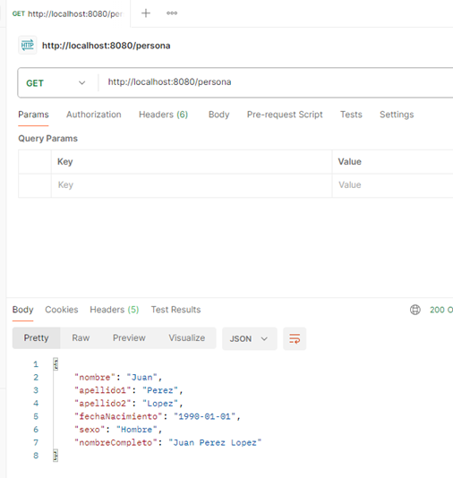

---

### Ejercicio 2: Introducción Spring 2
- Crear un servicio REST **POST** que reciba los siguientes campos desde el navegador o Postman:
  - Nombre
  - Primer apellido
  - Segundo apellido
  - Fecha de nacimiento
  - Sexo
- Los datos recibidos se almacenan en memoria (por ejemplo, en una variable global del controlador).  
- Se mostrará en la consola de la aplicación el contenido de los datos enviados de manera estructurada.

**Resultado en Postman:**

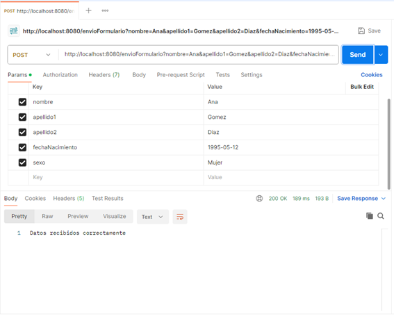

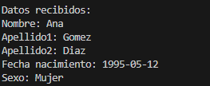

---

### Ejercicio 3: Introducción Spring 3
- Crear un bean **Personas** que contenga un atributo `List<Persona>` con **10 elementos iniciales**.  
- La clase **Persona** debe tener los atributos:
  - DNI
  - Nombre
  - Primer Apellido
  - Segundo Apellido
  - Fecha de nacimiento
  - Sexo
- Se pide:
  1. Mostrar los datos por pantalla correspondientes a un DNI existente.
  2. Sobreescribir los datos de la persona mediante **PUT** usando `@RequestBody`.
  3. Volver a mostrar los datos de la persona modificada.

**Resultados en Postman:**

- GET persona por DNI:  
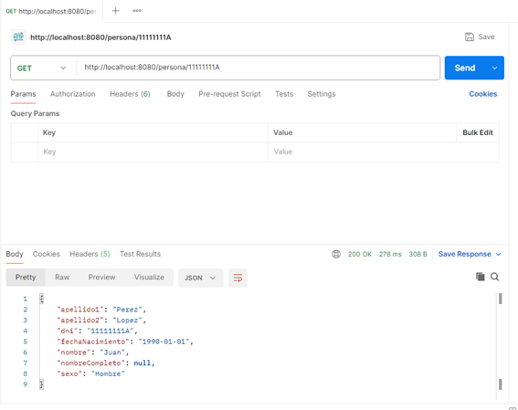

- PUT para actualizar persona:  
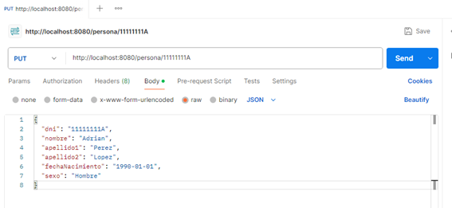

- GET de la persona actualizada:  
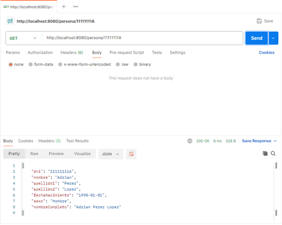

## Optativos
## Validaciones
Ejemplos de las validaciones.

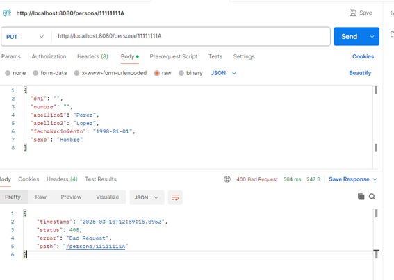

---

## Documentación Javadoc
Documentación generada con Javadoc.

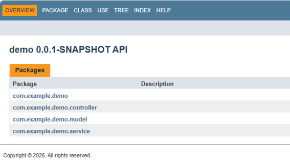

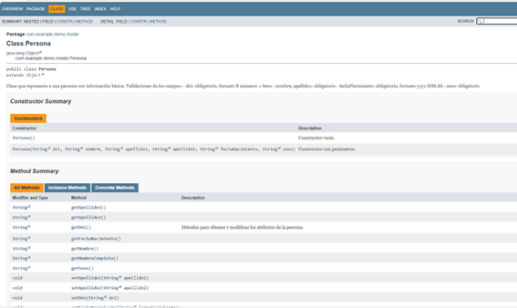

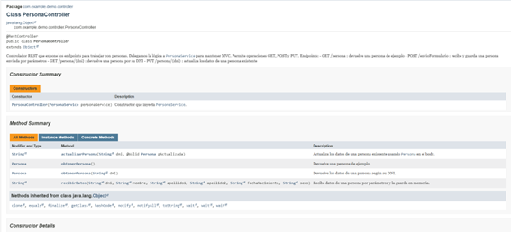

---

## Sistema de Logs
Registro de Logs.

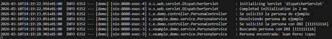

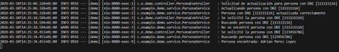
